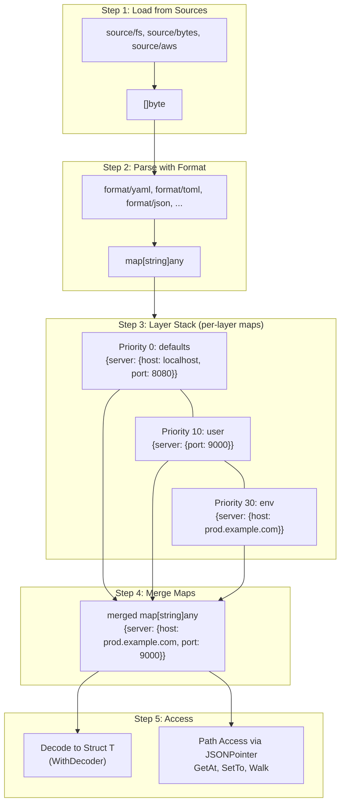

# Jubako

[](https://github.com/yacchi/jubako/actions/workflows/ci.yml)
[](https://codecov.io/gh/yacchi/jubako)
[](https://pkg.go.dev/github.com/yacchi/jubako)

**Jubako** (重箱) is a layered configuration management library for Go.

The name comes from traditional Japanese stacked boxes used for special occasions. Each layer (tier) contains different
items, and together they form a complete set - much like how this library manages configuration from multiple sources.

[日本語版 README](README_ja.md)

## Table of Contents

- [Features](#features)
- [Installation](#installation)
- [Quick Start](#quick-start)
- [Core Concepts](#core-concepts)
    - [Data Flow](#data-flow)
    - [Layers](#layers)
    - [JSON Pointer (RFC 6901)](#json-pointer-rfc-6901)
    - [Config Struct Definition](#config-struct-definition)
    - [Path Remapping (jubako tag)](#path-remapping-jubako-tag)
    - [Custom Decoder](#custom-decoder)
- [API Reference](#api-reference)
    - [Store[T]](#storet)
        - [Hot Reload (Watch)](#hot-reload-watch)
    - [Origin Tracking](#origin-tracking)
    - [Layer Information](#layer-information)
- [Supported Formats](#supported-formats)
    - [Environment Variable Layer](#environment-variable-layer)
        - [Schema-based Mapping](#schema-based-mapping)
- [Custom Format and Source Implementation](#custom-format-and-source-implementation)
    - [Source Interface](#source-interface)
    - [Document Interface](#document-interface)
    - [Layer Interface](#layer-interface)
- [Comparison with Typical Config Libraries](#comparison-with-typical-config-libraries)
- [License](#license)
- [Contributing](#contributing)

## Features

- **Layer-aware configuration** - Manage multiple config sources with priority ordering
- **Origin tracking** - Track which layer each configuration value comes from
- **Format preservation** - AST-based processing updates only changed values (preserves comments, whitespace,
  indentation, etc.)
- **Type-safe access** - Generics-based API with compile-time type checking
- **Change notifications** - Subscribe to configuration changes
- **Hot reload** - Automatically reload configuration when sources change (`Store.Watch`)

## Installation

```bash
go get github.com/yacchi/jubako
```

**Requirements:** Go 1.24+

### Optional format modules

Additional formats are provided as separate Go modules so their dependencies don’t become requirements of the core
library:

```bash
go get github.com/yacchi/jubako/format/yaml
go get github.com/yacchi/jubako/format/toml
go get github.com/yacchi/jubako/format/jsonc
```

## Quick Start

```go
package main

import (
	"context"
	"fmt"
	"log"

	"github.com/yacchi/jubako"
	"github.com/yacchi/jubako/format/yaml"
	"github.com/yacchi/jubako/layer"
	"github.com/yacchi/jubako/layer/env"
	"github.com/yacchi/jubako/source/bytes"
	"github.com/yacchi/jubako/source/fs"
)

type AppConfig struct {
	Server   ServerConfig   `yaml:"server" json:"server"`
	Database DatabaseConfig `yaml:"database" json:"database"`
}

type ServerConfig struct {
	Host string `yaml:"host" json:"host"`
	Port int    `yaml:"port" json:"port"`
}

type DatabaseConfig struct {
	URL string `yaml:"url" json:"url"`
}

const defaultsYAML = `
server:
  host: localhost
  port: 8080
database:
  url: postgres://localhost/myapp
`

func main() {
	ctx := context.Background()

	// Create a new store
	store := jubako.New[AppConfig]()

	// Add configuration layers (lower priority first)
	if err := store.Add(
		layer.New("defaults", bytes.FromString(defaultsYAML), yaml.New()),
		jubako.WithPriority(jubako.PriorityDefaults),
	); err != nil {
		log.Fatal(err)
	}

	if err := store.Add(
		layer.New("user", fs.New("~/.config/app/config.yaml"), yaml.New()),
		jubako.WithPriority(jubako.PriorityUser),
	); err != nil {
		log.Fatal(err)
	}

	if err := store.Add(
		layer.New("project", fs.New(".app.yaml"), yaml.New()),
		jubako.WithPriority(jubako.PriorityProject),
	); err != nil {
		log.Fatal(err)
	}

	if err := store.Add(
		env.New("env", "APP_"),
		jubako.WithPriority(jubako.PriorityEnv),
	); err != nil {
		log.Fatal(err)
	}

	// Load and materialize configuration
	if err := store.Load(ctx); err != nil {
		log.Fatal(err)
	}

	// Get the resolved configuration
	config := store.Get()
	fmt.Printf("Server: %s:%d\n", config.Server.Host, config.Server.Port)

	// Subscribe to changes
	unsubscribe := store.Subscribe(func(cfg AppConfig) {
		log.Printf("Config changed: %+v", cfg)
	})
	defer unsubscribe()
}
```

For complete working examples, see the [examples/](examples/) directory:

- [basic](examples/basic/) - Basic usage (adding layers, loading, modifying, saving)
- [env-override](examples/env-override/) - Environment variable overrides
- [origin-tracking](examples/origin-tracking/) - Detailed origin tracking features
- [path-remapping](examples/path-remapping/) - Path remapping with jubako struct tags (absolute/relative paths, slice/map support)
- [custom-decoder](examples/custom-decoder/) - Using mapstructure as a custom decoder
- [sensitive-masking](examples/sensitive-masking/) - Sensitive data handling (field marking, layer protection, value masking)

## Core Concepts

### Data Flow

The following diagram shows how configuration data flows through Jubako:



#### Step-by-Step Example

**1. Load from Sources**

Each Source reads raw bytes from its backend:

```
defaults.yaml (source/bytes)     user.yaml (source/fs)         APP_SERVER_HOST (layer/env)
─────────────────────────────    ─────────────────────────     ─────────────────────────────
server:                          server:                        APP_SERVER_HOST=prod.example.com
  host: localhost                  port: 9000
  port: 8080
```

**2. Parse with Format**

Each format implementation (`format/yaml`, `format/json`, etc.) converts bytes to `map[string]any`:

```go
// defaults.yaml → map[string]any
{"server": {"host": "localhost", "port": 8080}}

// user.yaml → map[string]any
{"server": {"port": 9000}}

// env vars → map[string]any
{"server": {"host": "prod.example.com"}}
```

**3. Layer Stack**

Maps are stacked by priority (lower = base, higher = override):

```
┌─────────────────────────────────────────┐
│ Priority 30: env                        │  ← highest (wins)
│ {"server": {"host": "prod.example.com"}}│
├─────────────────────────────────────────┤
│ Priority 10: user                       │
│ {"server": {"port": 9000}}              │
├─────────────────────────────────────────┤
│ Priority 0: defaults                    │  ← lowest (base)
│ {"server": {"host": "localhost",        │
│             "port": 8080}}              │
└─────────────────────────────────────────┘
```

**4. Merge Maps**

Higher priority values override lower priority (deep merge):

```go
// Merged result
{"server": {"host": "prod.example.com", "port": 9000}}
//                   ↑ from env (P:30)         ↑ from user (P:10)
```

**5. Access the Configuration**

The merged map can be accessed in two ways:

**A) Decode to Struct** (using `WithDecoder`, default: `encoding/json`)

```go
type Config struct {
    Server ServerConfig `json:"server"`  // ← json tag determines field mapping
}
type ServerConfig struct {
    Host string `json:"host"`
    Port int    `json:"port"`
}

config := store.Get()  // Config{Server: {Host: "prod.example.com", Port: 9000}}
```

**B) Path Access via JSONPointer** (using `WithTagName`, default: `json`)

```go
// JSONPointer paths are built from json tag names
store.GetAt("/server/host")  // → "prod.example.com"
store.GetAt("/server/port")  // → 9000
store.SetTo("user", "/server/port", 8000)
```

**C) Sensitive Field Protection** (using `jubako:"sensitive"` tag and `WithSensitive()`)

Sensitive fields are protected from cross-contamination between layers:

```go
type Config struct {
    Server      ServerConfig `json:"server"`
    Credentials Credentials  `json:"credentials" jubako:"sensitive"` // ← sensitive struct
}
type Credentials struct {
    APIKey    string `json:"api_key"`                       // sensitive (inherited)
    PublicKey string `json:"public_key" jubako:"!sensitive"` // opt-out
}
```

```
┌─────────────────────────────────────────────────────────────────────────┐
│                         Write Validation (SetTo)                        │
├─────────────────────────────────────────────────────────────────────────┤
│  Field Type    │  Normal Layer          │  Sensitive Layer              │
│                │  (default)             │  (WithSensitive())            │
├────────────────┼────────────────────────┼───────────────────────────────┤
│  Normal field  │  ✓ Allowed             │  ✗ ErrNormalFieldToSensitive  │
│  Sensitive     │  ✗ ErrSensitiveToNormal│  ✓ Allowed                    │
└────────────────┴────────────────────────┴───────────────────────────────┘
```

```go
// Layer setup
store.Add(layer.New("config", ...), jubako.WithPriority(0))           // normal layer
store.Add(layer.New("secrets", ...), jubako.WithSensitive())          // sensitive layer

// Write operations
store.SetTo("config", "/server/port", 9000)       // ✓ normal → normal
store.SetTo("secrets", "/credentials/api_key", "key") // ✓ sensitive → sensitive
store.SetTo("config", "/credentials/api_key", "key")  // ✗ ERROR: sensitive → normal
store.SetTo("secrets", "/server/port", 9000)          // ✗ ERROR: normal → sensitive
```

See [examples/sensitive-masking](examples/sensitive-masking/) for a complete example.

#### Option Effects

Each option affects a specific stage:

| Option | Type | Stage | Effect |
|--------|------|-------|--------|
| `WithPriority()` | Add | Layer Stack | Sets layer merge order |
| `WithReadOnly()` | Add | SetTo | Prevents modifications to layer |
| `WithSensitive()` | Add | SetTo | Marks layer for sensitive data only |
| `WithTagDelimiter()` | Store | Path Remapping | Delimiter for jubako tag parsing (default: `,`) |
| `WithTagName()` | Store | Path Access | Struct tag for JSONPointer path resolution (default: `json`) |
| `WithDecoder()` | Store | Decode to Struct | Custom map→struct decoder (default: `encoding/json`) |
| `WithSensitiveMask()` | Store | GetAt/Walk | Masks sensitive field values |

**Notes:**
- `WithTagName` affects path resolution for `GetAt`, `Walk`, `SetTo`, and sensitivity checking.
  The decoder (default: JSON) uses its own tag independently.
- `WithSensitive` enables write protection: sensitive fields can only be written to sensitive layers,
  and normal fields can only be written to normal layers.

### Layers

Each configuration source is represented as a layer with a priority. Higher priority layers override values from lower
priority layers.

```go
package main

import "github.com/yacchi/jubako"

func main() {
	_ = jubako.PriorityDefaults // 0: lowest
	_ = jubako.PriorityUser     // 10
	_ = jubako.PriorityProject  // 20
	_ = jubako.PriorityEnv      // 30
	_ = jubako.PriorityFlags    // 40: highest
}
```

**Priority Ordering Example:**

```
┌─────────────────────┐
│   Command Flags     │ ← Priority 40 (Highest)
├─────────────────────┤
│   Environment Vars  │ ← Priority 30
├─────────────────────┤
│   Project Config    │ ← Priority 20
├─────────────────────┤
│   User Config       │ ← Priority 10
├─────────────────────┤
│   Defaults          │ ← Priority 0 (Lowest)
└─────────────────────┘
```

### JSON Pointer (RFC 6901)

Jubako uses JSON Pointer for path-based configuration access:

```go
package main

import "github.com/yacchi/jubako/jsonptr"

func main() {
	// Build a pointer
	ptr1 := jsonptr.Build("server", "port")     // "/server/port"
	ptr2 := jsonptr.Build("servers", 0, "name") // "/servers/0/name"

	// Parse a pointer
	keys, _ := jsonptr.Parse("/server/port") // ["server", "port"]

	// Handle special characters
	ptr3 := jsonptr.Build("feature.flags", "on/off") // "/feature.flags/on~1off"

	_ = ptr1
	_ = ptr2
	_ = ptr3
	_ = keys
}
```

**Escaping Rules (RFC 6901):**

- `~` is encoded as `~0`
- `/` is encoded as `~1`

### Config Struct Definition

When defining config structs, `json` tags are required by default.
The materialization process uses `encoding/json` internally to decode the merged map into your struct.
Add format-specific tags such as `yaml` or `toml` as needed.

```go
package main

type AppConfig struct {
	Server   ServerConfig   `yaml:"server" json:"server"`
	Database DatabaseConfig `yaml:"database" json:"database"`
}

type ServerConfig struct {
	Host string `yaml:"host" json:"host"`
	Port int    `yaml:"port" json:"port"`
}

type DatabaseConfig struct {
	URL string `yaml:"url" json:"url"`
}
```

**Advanced features:**

- Use [jubako struct tags](#path-remapping-jubako-tag) to remap nested config paths to flat struct fields
- Use [custom decoders](#custom-decoder) (e.g., mapstructure) for more flexible decoding

### Path Remapping (jubako tag)

The `jubako` struct tag enables remapping nested configuration paths to flat struct fields.
This is useful when configuration files use nested structures for readability,
but your application prefers flat structs for convenience.

#### Path Types

| Format | Example | Description |
|--------|---------|-------------|
| Absolute | `/server/host` | Resolved from root (starts with `/`) |
| Relative | `connection/host` | Resolved from current context |
| Relative (explicit) | `./connection/host` | Same as above, explicit syntax |

#### Basic Usage

```go
package main

// Config file structure (nested for readability):
//   server:
//     http:
//       read_timeout: 30
//       write_timeout: 60
//
// Go struct (flat for convenience):
type ServerConfig struct {
	Host         string `json:"host" jubako:"/server/host"`
	Port         int    `json:"port" jubako:"/server/port"`
	ReadTimeout  int    `json:"read_timeout" jubako:"/server/http/read_timeout"`
	WriteTimeout int    `json:"write_timeout" jubako:"/server/http/write_timeout"`
	// Skip field from remapping
	Internal     string `json:"internal" jubako:"-"`
}
```

#### Slice Elements with Relative Paths

When struct elements are inside a slice, use relative paths (no leading `/`) to resolve
from each element's context:

```go
package main

// Config file structure:
//   defaults:
//     timeout: 30
//   nodes:
//     - connection:
//         host: node1.example.com
//         port: 5432
//     - connection:
//         host: node2.example.com
//         port: 5433

type Node struct {
	// Relative paths - resolved from each slice element
	Host string `json:"host" jubako:"connection/host"`
	Port int    `json:"port" jubako:"connection/port"`
	// Absolute path - resolved from root (shared across all elements)
	DefaultTimeout int `json:"default_timeout" jubako:"/defaults/timeout"`
}

type ClusterConfig struct {
	Nodes []Node `json:"nodes"`
}
```

#### Map Values with Relative Paths

Same pattern works for map values:

```go
package main

// Config file structure:
//   defaults:
//     retries: 3
//   services:
//     api:
//       settings:
//         endpoint: https://api.example.com
//     web:
//       settings:
//         endpoint: https://web.example.com

type ServiceConfig struct {
	// Relative path - resolved from each map value
	Endpoint string `json:"endpoint" jubako:"settings/endpoint"`
	// Absolute path - resolved from root
	DefaultRetries int `json:"default_retries" jubako:"/defaults/retries"`
}

type Config struct {
	Services map[string]ServiceConfig `json:"services"`
}
```

#### Inspecting the Mapping Table

You can inspect the mapping table for debugging:

```go
package main

import (
	"fmt"

	"github.com/yacchi/jubako"
)

type Node struct {
	Host           string `json:"host" jubako:"connection/host"`
	Port           int    `json:"port" jubako:"connection/port"`
	DefaultTimeout int    `json:"default_timeout" jubako:"/defaults/timeout"`
}

type ClusterConfig struct {
	Nodes []Node `json:"nodes"`
}

func main() {
	store := jubako.New[ClusterConfig]()

	// Check if struct has any jubako mappings
	if store.HasMappings() {
		fmt.Println(store.MappingTable())
	}
}

// Output:
// nodes[]: (slice element)
//   host <- ./connection/host (relative)
//   port <- ./connection/port (relative)
//   default_timeout <- /defaults/timeout
```

See [examples/path-remapping](examples/path-remapping/) for a complete working example.

### Custom Decoder

By default, Jubako uses `encoding/json` to convert the merged `map[string]any` into your config struct.
You can replace this decoder using the `WithDecoder` option:

```go
store := jubako.New[Config](jubako.WithDecoder(myCustomDecoder))
```

The decoder must match the `decoder.Func` type:

```go
type Func func(data map[string]any, target any) error
```

**When to use a custom decoder:**

- Use custom struct tags (e.g., `mapstructure` instead of `json`)
- Enable weak type conversion (e.g., string `"8080"` to int `8080`)
- Handle embedded structs or remaining fields capture
- Integrate with existing decoding pipelines

See [examples/custom-decoder](examples/custom-decoder/) for a complete example using [mapstructure](https://github.com/mitchellh/mapstructure).

## API Reference

### Store[T]

Store is the central type for configuration management.

#### Creation and Options

```go
package main

import "github.com/yacchi/jubako"

type AppConfig struct{}

func main() {
	// Create a new store
	store := jubako.New[AppConfig]()

	// Specify auto-priority step (default: 10)
	storeWithStep := jubako.New[AppConfig](jubako.WithPriorityStep(100))

	_ = store
	_ = storeWithStep
}
```

#### Adding Layers

```go
package main

import (
	"github.com/yacchi/jubako"
	"github.com/yacchi/jubako/format/yaml"
	"github.com/yacchi/jubako/layer"
	"github.com/yacchi/jubako/source/bytes"
	"github.com/yacchi/jubako/source/fs"
)

type AppConfig struct{}

const (
	defaultsYAML = ""
	baseYAML     = ""
	overrideYAML = ""
)

func main() {
	store := jubako.New[AppConfig]()

	// Add layer with explicit priority
	err := store.Add(
		layer.New("defaults", bytes.FromString(defaultsYAML), yaml.New()),
		jubako.WithPriority(jubako.PriorityDefaults),
	)

	// Add as read-only (prevents modifications via SetTo)
	err = store.Add(
		layer.New("system", fs.New("/etc/app/config.yaml"), yaml.New()),
		jubako.WithPriority(jubako.PriorityDefaults),
		jubako.WithReadOnly(),
	)

	// Without priority, auto-assigned in order (0, 10, 20, ...)
	err = store.Add(layer.New("base", bytes.FromString(baseYAML), yaml.New()))
	err = store.Add(layer.New("override", bytes.FromString(overrideYAML), yaml.New()))

	_ = err
}
```

#### Loading and Access

```go
package main

import (
	"context"
	"fmt"

	"github.com/yacchi/jubako"
)

type AppConfig struct {
	Server struct {
		Port int `json:"port"`
	} `json:"server"`
}

func main() {
	ctx := context.Background()
	store := jubako.New[AppConfig]()

	// Load all layers
	err := store.Load(ctx)

	// Reload configuration
	err = store.Reload(ctx)

	// Get merged configuration
	config := store.Get()
	fmt.Println(config.Server.Port)

	_ = err
}
```

#### Change Notifications

```go
package main

import (
	"log"

	"github.com/yacchi/jubako"
)

type AppConfig struct{}

func main() {
	store := jubako.New[AppConfig]()

	// Subscribe to configuration changes
	unsubscribe := store.Subscribe(func(cfg AppConfig) {
		log.Printf("Config changed: %+v", cfg)
	})
	defer unsubscribe()
}
```

#### Hot Reload (Watch)

`Store.Watch` watches configuration layers for changes, automatically reloads the store, and notifies subscribers.
Typically, call `Load` once before `Watch` to materialize an initial snapshot.

```go
package main

import (
	"context"
	"log"

	"github.com/yacchi/jubako"
)

type AppConfig struct{}

func main() {
	ctx := context.Background()
	store := jubako.New[AppConfig]()

	stop, err := store.Watch(ctx, jubako.DefaultStoreWatchConfig())
	if err != nil {
		log.Fatal(err)
	}
	defer stop(context.Background())
}
```

Notes:

- Layers added with `jubako.WithNoWatch()` are skipped.
- `StoreWatchConfig.OnError` receives `layer.Name("")` for store-level errors (e.g., materialization failures).
- `StoreWatchConfig.WatcherOpts` configures polling behavior (e.g., `watcher.WithPollInterval`, `watcher.WithCompareFunc`); subscription-based watchers may ignore polling-specific options.

#### Modifying and Saving

```go
package main

import (
	"context"

	"github.com/yacchi/jubako"
)

type AppConfig struct{}

func main() {
	ctx := context.Background()
	store := jubako.New[AppConfig]()

	// Modify value in specific layer (in memory)
	err := store.SetTo("user", "/server/port", 9000)

	// Check for unsaved changes
	if store.IsDirty() {
		// Save all modified layers
		err = store.Save(ctx)

		// Or save specific layer only
		err = store.SaveLayer(ctx, "user")
	}

	_ = err
}
```

Note: `Save`/`SaveLayer` only writes layers with pending changes (set via `SetTo` or `Set`).
This avoids rewriting unchanged documents, which could otherwise re-serialize and lose formatting/comments depending on the format.

#### Bulk Set with Functional Options

The `Set` method provides a flexible way to set multiple values at once using functional options:

```go
package main

import (
	"context"

	"github.com/yacchi/jubako"
)

type AppConfig struct {
	Server struct {
		Host string `json:"host"`
		Port int    `json:"port"`
	} `json:"server"`
}

type Credential struct {
	Username string `json:"username"`
	Password string `json:"password"`
}

func main() {
	ctx := context.Background()
	store := jubako.New[AppConfig]()

	// Set multiple values with type-safe helpers
	err := store.Set("user",
		jubako.String("/server/host", "localhost"),
		jubako.Int("/server/port", 8080),
	)

	// Use Path for grouping under a common prefix
	err = store.Set("user", jubako.Path("/server",
		jubako.String("host", "localhost"),
		jubako.Int("port", 8080),
	))

	// Expand a struct into multiple path-value pairs
	cred := Credential{Username: "admin", Password: "secret"}
	err = store.Set("user",
		jubako.Struct("/credential", cred),
		jubako.SkipZeroValues(), // Skip fields with zero values
	)

	// Use Map to set multiple values from a map
	err = store.Set("user", jubako.Map("/settings", map[string]any{
		"timeout": 30,
		"retries": 3,
	}))

	// Delete values by setting nil with DeleteNilValue option
	err = store.Set("user",
		jubako.Value("/old_field", nil),
		jubako.DeleteNilValue(),
	)

	_ = ctx
	_ = err
}
```

**Available SetOption functions:**

| Function | Description |
|----------|-------------|
| `String(path, value)` | Set a string value |
| `Int(path, value)` | Set an integer value |
| `Int64(path, value)` | Set an int64 value |
| `Float(path, value)` | Set a float64 value |
| `Bool(path, value)` | Set a boolean value |
| `Value(path, value)` | Set any value |
| `Struct(path, v)` | Expand struct fields into path-value pairs |
| `Map(path, m)` | Expand map entries into path-value pairs |
| `Path(prefix, opts...)` | Group options under a common path prefix |
| `SkipZeroValues()` | Skip entries with zero values |
| `DeleteNilValue()` | Treat nil values as delete operations |

### Origin Tracking

Track which layer each configuration value comes from.

#### GetAt - Get Single Value

```go
package main

import (
	"fmt"

	"github.com/yacchi/jubako"
)

type AppConfig struct{}

func main() {
	store := jubako.New[AppConfig]()

	rv := store.GetAt("/server/port")
	if rv.Exists {
		fmt.Printf("port=%v (from layer %s)\n", rv.Value, rv.Layer.Name())
	}
}
```

#### GetAllAt - Get Values from All Layers

```go
package main

import (
	"fmt"

	"github.com/yacchi/jubako"
)

type AppConfig struct{}

func main() {
	store := jubako.New[AppConfig]()

	values := store.GetAllAt("/server/port")
	for _, rv := range values {
		fmt.Printf("port=%v (from layer %s, priority %d)\n",
			rv.Value, rv.Layer.Name(), rv.Layer.Priority())
	}

	// Get the highest priority value
	effective := values.Effective()
	fmt.Printf("effective: %v\n", effective.Value)
}
```

#### Walk - Traverse All Values

```go
package main

import (
	"fmt"

	"github.com/yacchi/jubako"
)

type AppConfig struct{}

func main() {
	store := jubako.New[AppConfig]()

	// Get resolved value for each path
	store.Walk(func(ctx jubako.WalkContext) bool {
		rv := ctx.Value()
		fmt.Printf("%s = %v (from %s)\n", ctx.Path, rv.Value, rv.Layer.Name())
		return true // continue
	})

	// Get all layer values for each path (analyze override chain)
	store.Walk(func(ctx jubako.WalkContext) bool {
		allValues := ctx.AllValues()
		if allValues.Len() > 1 {
			fmt.Printf("%s has values from %d layers:\n", ctx.Path, allValues.Len())
			for _, rv := range allValues {
				fmt.Printf("  - %s: %v\n", rv.Layer.Name(), rv.Value)
			}
		}
		return true
	})
}
```

See [examples/origin-tracking](examples/origin-tracking/) for detailed usage.

### Layer Information

```go
package main

import (
	"fmt"

	"github.com/yacchi/jubako"
)

type AppConfig struct{}

func main() {
	store := jubako.New[AppConfig]()

	// Get specific layer info
	info := store.GetLayerInfo("user")
	if info != nil {
		fmt.Printf("Name: %s\n", info.Name())
		fmt.Printf("Priority: %d\n", info.Priority())
		fmt.Printf("Format: %s\n", info.Format())
		fmt.Printf("Path: %s\n", info.Path()) // for file-based layers
		fmt.Printf("Loaded: %v\n", info.Loaded())
		fmt.Printf("ReadOnly: %v\n", info.ReadOnly())
		fmt.Printf("Writable: %v\n", info.Writable())
		fmt.Printf("Dirty: %v\n", info.Dirty())
	}

	// List all layers (sorted by priority)
	for _, info := range store.ListLayers() {
		fmt.Printf("[%d] %s (writable: %v)\n",
			info.Priority(), info.Name(), info.Writable())
	}
}
```

## Supported Formats

Jubako supports two types of format implementations:

### Full Support Formats (Format Preservation)

These formats update only changed values while preserving the original format including comments,
blank lines, indentation, and key ordering.

| Format | Package        | Description                                      |
|--------|----------------|--------------------------------------------------|
| YAML   | `format/yaml`  | Uses yaml.Node AST from `gopkg.in/yaml.v3`       |
| TOML   | `format/toml`  | Preserves comments/format via minimal text edits |
| JSONC  | `format/jsonc` | Preserves comments/format via hujson AST         |

```go
package main

import (
	"github.com/yacchi/jubako"
	"github.com/yacchi/jubako/format/yaml"
	"github.com/yacchi/jubako/layer"
	"github.com/yacchi/jubako/source/fs"
)

type AppConfig struct{}

func main() {
	store := jubako.New[AppConfig]()

	// YAML (with comment preservation)
	_ = store.Add(
		layer.New("user", fs.New("~/.config/app.yaml"), yaml.New()),
		jubako.WithPriority(jubako.PriorityUser),
	)
}
```

With full support formats, the original format is preserved when modifying values:

```yaml
# User settings

server:
  port: 8080  # Custom port

# ↑ After store.SetTo("user", "/server/port", 9000),
# comments, blank lines, and indentation remain intact
```

### Simple Support Formats (No Format Preservation)

These formats support reading and writing but do not preserve comments and
formatting. Output is regenerated on save.

| Format | Package       | Description                           |
|--------|---------------|---------------------------------------|
| JSON   | `format/json` | Uses standard library `encoding/json` |

```go
package main

import (
	"github.com/yacchi/jubako"
	"github.com/yacchi/jubako/format/json"
	"github.com/yacchi/jubako/layer"
	"github.com/yacchi/jubako/source/fs"
)

type AppConfig struct{}

func main() {
	store := jubako.New[AppConfig]()

	// JSON (without comment preservation)
	_ = store.Add(
		layer.New("config", fs.New("config.json"), json.New()),
		jubako.WithPriority(jubako.PriorityProject),
	)
}
```

### Summary

| Source                | How to add                                    | Format Preservation |
|-----------------------|-----------------------------------------------|---------------------|
| YAML                  | `layer.New(..., <source>, yaml.New())`        | Yes                 |
| TOML                  | `layer.New(..., <source>, toml.New())`        | Yes                 |
| JSONC                 | `layer.New(..., <source>, jsonc.New())`       | Yes                 |
| JSON                  | `layer.New(..., <source>, json.New())`        | No                  |
| Environment variables | `env.New(name, prefix)`                       | N/A                 |

### Environment Variable Layer

The environment variable layer reads environment variables with a matching prefix:

```go
package main

import (
	"github.com/yacchi/jubako"
	"github.com/yacchi/jubako/layer/env"
)

type AppConfig struct{}

func main() {
	store := jubako.New[AppConfig]()

	// Read environment variables with APP_ prefix
	// APP_SERVER_HOST -> /server/host
	// APP_DATABASE_USER -> /database/user
	_ = store.Add(
		env.New("env", "APP_"),
		jubako.WithPriority(jubako.PriorityEnv),
	)
}
```

**Note**: Environment variables are always read as strings. However, by using JSON Pointer paths with numeric segments (e.g., `APP_ITEMS_0`, `APP_SERVERS_0_HOST`), array structures can be created. For explicit type conversions (e.g., string "8080" to int 8080), you can use a custom `TransformFunc` or schema-based mapping (see below).

This also applies to numeric fields; `jsonptr` will attempt to convert numeric path segments to array indices. If you need explicit type conversion for the *value* (e.g., "8080" to `int 8080`), you can provide a custom `TransformFunc` or use schema-based mapping.

See [examples/env-override](examples/env-override/) for detailed usage.

#### Schema-based Mapping

For type-safe environment variable mapping with automatic type conversion, use `WithSchemaMapping`.
This eliminates the need for manual `TransformFunc` implementations by using struct tags:

```go
package main

import (
	"context"
	"fmt"
	"log"
	"time"

	"github.com/yacchi/jubako"
	"github.com/yacchi/jubako/layer/env"
)

type Config struct {
	Server   ServerConfig   `json:"server"`
	Features []string       `json:"features" jubako:"env:FEATURES"`
	Debug    bool           `json:"debug" jubako:"env:DEBUG"`
}

type ServerConfig struct {
	Host    string        `json:"host" jubako:"env:SERVER_HOST"`
	Port    int           `json:"port" jubako:"env:SERVER_PORT"`
	Timeout time.Duration `json:"timeout" jubako:"env:SERVER_TIMEOUT"`
}

func main() {
	ctx := context.Background()
	store := jubako.New[Config]()

	// Schema-based mapping: env var names in tags do NOT include prefix
	// APP_SERVER_HOST -> /server/host (string)
	// APP_SERVER_PORT -> /server/port (int, auto-converted)
	// APP_SERVER_TIMEOUT -> /server/timeout (time.Duration, auto-converted)
	// APP_FEATURES -> /features ([]string, comma-separated)
	// APP_DEBUG -> /debug (bool, auto-converted)
	if err := store.Add(
		env.New("env", "APP_", env.WithSchemaMapping[Config]()),
		jubako.WithPriority(jubako.PriorityEnv),
	); err != nil {
		log.Fatal(err)
	}

	if err := store.Load(ctx); err != nil {
		log.Fatal(err)
	}

	config := store.Get()
	fmt.Printf("Server: %s:%d (timeout: %v)\n",
		config.Server.Host, config.Server.Port, config.Server.Timeout)
	fmt.Printf("Debug: %v, Features: %v\n", config.Debug, config.Features)
}
```

**Key features:**

| Feature | Description |
|---------|-------------|
| Automatic type conversion | Strings are converted to the target field type (`int`, `bool`, `float64`, `time.Duration`, etc.) |
| Prefix handling | Env var names in `jubako:"env:..."` tags do NOT include the prefix |
| Nested struct support | Mappings work with nested structs; JSON path is built from field hierarchy |
| Custom path override | Combine with path remapping: `jubako:"/custom/path,env:VAR_NAME"` |
| Slice support | Comma-separated values are split into `[]string` |

**Supported types:**

| Type | Conversion |
|------|------------|
| `string` | No conversion |
| `int`, `int8`, `int16`, `int32`, `int64` | `strconv.ParseInt` |
| `uint`, `uint8`, `uint16`, `uint32`, `uint64` | `strconv.ParseUint` |
| `float32`, `float64` | `strconv.ParseFloat` |
| `bool` | `strconv.ParseBool` (accepts `true`, `false`, `1`, `0`) |
| `[]string` | Split by comma (e.g., `"a,b,c"` → `["a", "b", "c"]`) |
| `time.Duration` | `time.ParseDuration` (e.g., `"30s"`, `"1h30m"`) |

**Example with custom path:**

```go
type Config struct {
	// Maps APP_PORT to /server/listen_port (not /port)
	Port int `json:"port" jubako:"/server/listen_port,env:PORT"`
}
```

**Dynamic Map/Slice Mapping:**

You can use `{key}` and `{index}` placeholders to map dynamic keys in maps and indices in slices.

```go
type Config struct {
	// Map keys: APP_USERS_ALICE_NAME -> /users/ALICE/name
	Users map[string]User `json:"users"`
	// Slice indices: APP_PORTS_0_NUM -> /ports/0/num
	Ports []PortConfig    `json:"ports"`
}

type User struct {
	Name string `json:"name" jubako:"env:USERS_{key}_NAME"`
	Role string `json:"role" jubako:"env:USERS_{key}_ROLE"`
}

type PortConfig struct {
	Num int `json:"num" jubako:"env:PORTS_{index}_NUM"`
}
```

#### Template Transformation

The `env` tag placeholders `\{key\}` and `\{index\}` can now include `text/template` style filter functions using the pipe `|` syntax. This allows for dynamic string manipulation of the captured value during path generation.

**Syntax:**

```go
`jubako:"env:MY_VAR_{key|filter1|filter2}"`
```

**Available default functions:**

- `lower`: Converts string to lowercase (`strings.ToLower`)
- `upper`: Converts string to uppercase (`strings.ToUpper`)
- `escape`: Escapes special JSON Pointer characters (`jsonptr.Escape`) - **applied automatically as the final step if no `escape` filter is explicitly specified.**

**Example:**

Consider environment variables `APP_BACKLOG_CLIENT_ID_JP=...` and `APP_BACKLOG_CLIENT_ID_US=...`.
To map these to lowercase keys (`jp`, `us`) in a Go map:

```go
type Config struct {
	// Example: APP_BACKLOG_CLIENT_ID_JP -> /backlog/jp/client_id
	Backlog map[string]struct {
		ClientID string `json:"client_id" jubako:"env:BACKLOG_CLIENT_ID_{key|lower}"`
	} `json:"backlog"`
}
```

In this example, the value captured by `{key}` (e.g., "JP") will be passed through the `lower` filter, resulting in "jp" for the JSON Pointer path segment. The `escape` filter is automatically applied after `lower` to ensure JSON Pointer compliance.

See [examples/env-template-transform](examples/env-template-transform/) for a complete working example.

## Custom Format and Source Implementation

Jubako has an extensible architecture. You can implement custom formats and sources.

### Source Interface

Source handles configuration data I/O (format-agnostic):

```go
package source

import "context"

// source/source.go
type Source interface {
	// Load reads configuration data from the source.
	Load(ctx context.Context) ([]byte, error)

	// Save writes data back to the source using optimistic locking.
	// Returns ErrSaveNotSupported if saving is not supported.
	// Returns ErrSourceModified if the source was modified externally.
	Save(ctx context.Context, updateFunc UpdateFunc) error

	// CanSave returns whether saving is supported.
	CanSave() bool
}
```

**Example Implementation (HTTP Source)**:

```go
package main

import (
	"context"
	"io"
	"net/http"

	"github.com/yacchi/jubako/source"
)

type HTTPSource struct {
	url string
}

func NewHTTP(url string) *HTTPSource {
	return &HTTPSource{url: url}
}

func (s *HTTPSource) Load(ctx context.Context) ([]byte, error) {
	req, err := http.NewRequestWithContext(ctx, "GET", s.url, nil)
	if err != nil {
		return nil, err
	}
	resp, err := http.DefaultClient.Do(req)
	if err != nil {
		return nil, err
	}
	defer resp.Body.Close()
	return io.ReadAll(resp.Body)
}

func (s *HTTPSource) Save(ctx context.Context, updateFunc source.UpdateFunc) error {
	return source.ErrSaveNotSupported
}

func (s *HTTPSource) CanSave() bool {
	return false
}

// Usage:
//
//  store.Add(
//      layer.New("remote", NewHTTP("https://config.example.com/app.yaml"), yaml.New()),
//      jubako.WithPriority(jubako.PriorityDefaults),
//  )
```

### Document Interface

Document is a stateless format handler. It parses bytes into `map[string]any` and
can apply a `document.JSONPatchSet` to update bytes (optionally preserving
comments and formatting).

```go
package document

type DocumentFormat string

// document/document.go
type Document interface {
	// Get parses data bytes and returns content as map[string]any.
	// Returns empty map if data is nil or empty.
	Get(data []byte) (map[string]any, error)

	// Apply applies changeset to data bytes and returns new bytes.
	// For comment-preserving formats, Apply can use changeset to keep
	// comments/formatting stable.
	Apply(data []byte, changeset JSONPatchSet) ([]byte, error)

	// Format returns the document format.
	Format() DocumentFormat

	// CanApply returns true if Apply can preserve comments/formatting.
	CanApply() bool

	// MarshalTestData converts data to bytes for testing.
	MarshalTestData(data map[string]any) ([]byte, error)
}
```

### Layer Interface

Layer represents a configuration source that loads data as `map[string]any` and
can optionally save changes via a `document.JSONPatchSet`. Use `layer.New(name, source, document)`
to create a standard layer. The returned `Layer` also implements optional interfaces
(`SourceProvider`, `DocumentProvider`, `FormatProvider`, `WatchableLayer`) for accessing
the underlying components:

```go
package layer

import (
	"context"

	"github.com/yacchi/jubako/document"
)

type Name string

// layer/layer.go
type Layer interface {
	// Name returns the unique identifier for this layer.
	Name() Name

	// Load reads configuration and returns data as map[string]any.
	Load(ctx context.Context) (map[string]any, error)

	// Save persists changes back to the source using optimistic locking.
	Save(ctx context.Context, changeset document.JSONPatchSet) error

	// CanSave returns whether saving is supported.
	CanSave() bool
}
```

See the following packages for existing implementations:

- `source/bytes` - Byte slice source (read-only)
- `source/fs` - File system source
- `format/yaml` - YAML document (separate module, comment preservation)
- `format/toml` - TOML document (separate module, comment + format preservation)
- `format/jsonc` - JSONC document (separate module, comment + format preservation)
- `format/json` - JSON document (standard library, no comment preservation)
- `layer/env` - Environment variable layer

## Comparison with Typical Config Libraries

| Feature                | Jubako                                              | Typical Libraries                   |
|------------------------|-----------------------------------------------------|-------------------------------------|
| Layer tracking         | Per-layer preservation                              | Merged (irreversible)               |
| Origin tracking        | Yes                                                 | No                                  |
| Write support          | Layer-aware write-back                              | Limited                             |
| Format preservation    | Yes (AST-based, supported formats)                  | No                                  |
| Change notifications   | Built-in `Subscribe` + `Watch` (debounce supported)  | Often manual or coarse              |
| Path-based read/write  | JSON Pointer API (`GetAt`, `SetTo`)                 | Ad-hoc key strings                  |
| Dirty tracking         | Per-layer dirty + store-level `IsDirty()`           | Usually none                        |
| Safe writes            | Patch-based updates + optimistic locking            | Full rewrite, last-writer-wins      |
| Layer controls         | Per-layer read-only and watch disable options       | Rare                                |
| Extensibility          | Pluggable `Source` / `Document` / `Layer` interfaces| Often format/source-specific        |

## License

Apache License 2.0

## Contributing

Contributions are welcome! Please feel free to submit a Pull Request.
