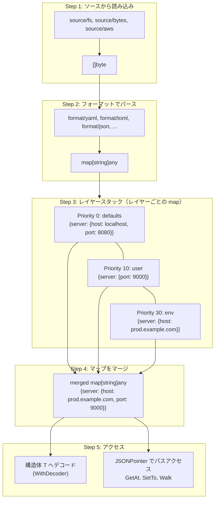

# Jubako

**Jubako**（重箱）は、Go 言語向けのレイヤー型設定管理ライブラリです。

複数の設定ソースをレイヤーとして扱い、優先度に従って最終的な設定を解決します。名前は重箱にちなんでいます。

[English README](README.md)

## 目次

- [特徴](#特徴)
- [インストール](#インストール)
- [クイックスタート](#クイックスタート)
- [コアコンセプト](#コアコンセプト)
    - [データフロー](#データフロー)
    - [レイヤー](#レイヤー)
    - [JSON Pointer (RFC 6901)](#json-pointer-rfc-6901)
    - [設定構造体の定義](#設定構造体の定義)
    - [パスリマッピング (jubako タグ)](#パスリマッピング-jubako-タグ)
    - [カスタムデコーダー](#カスタムデコーダー)
- [API リファレンス](#api-リファレンス)
    - [Store[T]](#storet)
        - [ホットリロード (Watch)](#ホットリロード-watch)
    - [オリジン追跡](#オリジン追跡)
    - [レイヤー情報](#レイヤー情報)
- [サポートされるフォーマット](#サポートされるフォーマット)
    - [環境変数レイヤー](#環境変数レイヤー)
        - [スキーマベースマッピング](#スキーマベースマッピング)
- [独自フォーマット・ソースの作成](#独自フォーマットソースの作成)
    - [Source インターフェース](#source-インターフェース)
    - [Document インターフェース](#document-インターフェース)
    - [Layer インターフェース](#layer-インターフェース)
- [一般的な設定ライブラリとの比較](#一般的な設定ライブラリとの比較)
- [ライセンス](#ライセンス)
- [コントリビューション](#コントリビューション)

## 特徴

- **レイヤー対応の設定管理** - 優先度順序付きで複数の設定ソースを管理
- **オリジン追跡** - 各設定値がどのレイヤーから来たか追跡可能
- **フォーマット保持** - AST ベースの処理により変更箇所のみを更新（コメント・空行・インデント等を維持）
- **型安全なアクセス** - ジェネリクスベースの API でコンパイル時の型チェック
- **変更通知** - 設定変更をサブスクライブ可能
- **ホットリロード** - ソース変更時に自動で再読込（`Store.Watch`）

## インストール

```bash
go get github.com/yacchi/jubako
```

**動作要件:** Go 1.24 以上

## クイックスタート

```go
package main

import (
	"context"
	"fmt"
	"log"

	"github.com/yacchi/jubako"
	"github.com/yacchi/jubako/format/yaml"
	"github.com/yacchi/jubako/layer"
	"github.com/yacchi/jubako/layer/env"
	"github.com/yacchi/jubako/source/bytes"
	"github.com/yacchi/jubako/source/fs"
)

type AppConfig struct {
	Server   ServerConfig   `yaml:"server" json:"server"`
	Database DatabaseConfig `yaml:"database" json:"database"`
}

type ServerConfig struct {
	Host string `yaml:"host" json:"host"`
	Port int    `yaml:"port" json:"port"`
}

type DatabaseConfig struct {
	URL string `yaml:"url" json:"url"`
}

const defaultsYAML = `
server:
  host: localhost
  port: 8080
database:
  url: postgres://localhost/myapp
`

func main() {
	ctx := context.Background()

	// 新しいストアを作成
	store := jubako.New[AppConfig]()

	// 設定レイヤーを追加（優先度の低い順）
	if err := store.Add(
		layer.New("defaults", bytes.FromString(defaultsYAML), yaml.New()),
		jubako.WithPriority(jubako.PriorityDefaults),
	); err != nil {
		log.Fatal(err)
	}

	if err := store.Add(
		layer.New("user", fs.New("~/.config/app/config.yaml"), yaml.New()),
		jubako.WithPriority(jubako.PriorityUser),
	); err != nil {
		log.Fatal(err)
	}

	if err := store.Add(
		layer.New("project", fs.New(".app.yaml"), yaml.New()),
		jubako.WithPriority(jubako.PriorityProject),
	); err != nil {
		log.Fatal(err)
	}

	if err := store.Add(
		env.New("env", "APP_"),
		jubako.WithPriority(jubako.PriorityEnv),
	); err != nil {
		log.Fatal(err)
	}

	// 設定を読み込みマテリアライズ
	if err := store.Load(ctx); err != nil {
		log.Fatal(err)
	}

	// 解決済みの設定を取得
	config := store.Get()
	fmt.Printf("Server: %s:%d\n", config.Server.Host, config.Server.Port)

	// 変更をサブスクライブ
	unsubscribe := store.Subscribe(func(cfg AppConfig) {
		log.Printf("Config changed: %+v", cfg)
	})
	defer unsubscribe()
}
```

完全な動作例は [examples/](examples/) ディレクトリを参照してください：

- [basic](examples/basic/) - 基本的な使い方（レイヤー追加、読み込み、変更、保存）
- [env-override](examples/env-override/) - 環境変数による設定上書き
- [origin-tracking](examples/origin-tracking/) - オリジン追跡機能の詳細
- [path-remapping](examples/path-remapping/) - jubako タグによるパスリマッピング（絶対/相対パス、slice/map 対応）
- [custom-decoder](examples/custom-decoder/) - mapstructure を使ったカスタムデコーダー
- [sensitive-masking](examples/sensitive-masking/) - センシティブデータの取り扱い（フィールド指定、レイヤー保護、値のマスキング）

## コアコンセプト

### データフロー

以下の図は、Jubako における設定データの流れを示しています：



#### ステップバイステップの例

**1. ソースから読み込み**

各 Source がバックエンドから生のバイト列を読み込みます：

```
defaults.yaml (source/bytes)     user.yaml (source/fs)         APP_SERVER_HOST (layer/env)
─────────────────────────────    ─────────────────────────     ─────────────────────────────
server:                          server:                        APP_SERVER_HOST=prod.example.com
  host: localhost                  port: 9000
  port: 8080
```

**2. フォーマットでパース**

各フォーマット実装（`format/yaml`、`format/json` など）がバイト列を `map[string]any` に変換します：

```go
// defaults.yaml → map[string]any
{"server": {"host": "localhost", "port": 8080}}

// user.yaml → map[string]any
{"server": {"port": 9000}}

// env vars → map[string]any
{"server": {"host": "prod.example.com"}}
```

**3. レイヤースタック**

マップが優先度順にスタックされます（低い = ベース、高い = 上書き）：

```
┌─────────────────────────────────────────┐
│ Priority 30: env                        │  ← 最高（優先）
│ {"server": {"host": "prod.example.com"}}│
├─────────────────────────────────────────┤
│ Priority 10: user                       │
│ {"server": {"port": 9000}}              │
├─────────────────────────────────────────┤
│ Priority 0: defaults                    │  ← 最低（ベース）
│ {"server": {"host": "localhost",        │
│             "port": 8080}}              │
└─────────────────────────────────────────┘
```

**4. マップをマージ**

優先度の高い値が低い値を上書きします（ディープマージ）：

```go
// マージ結果
{"server": {"host": "prod.example.com", "port": 9000}}
//                   ↑ env (P:30) から         ↑ user (P:10) から
```

**5. 設定へのアクセス**

マージされたマップには2つの方法でアクセスできます：

**A) 構造体へデコード**（`WithDecoder` 使用、デフォルト: `encoding/json`）

```go
type Config struct {
    Server ServerConfig `json:"server"`  // ← json タグでフィールドマッピング
}
type ServerConfig struct {
    Host string `json:"host"`
    Port int    `json:"port"`
}

config := store.Get()  // Config{Server: {Host: "prod.example.com", Port: 9000}}
```

**B) JSONPointer でパスアクセス**（`WithTagName` 使用、デフォルト: `json`）

```go
// JSONPointer パスは json タグ名から構築される
store.GetAt("/server/host")  // → "prod.example.com"
store.GetAt("/server/port")  // → 9000
store.SetTo("user", "/server/port", 8000)
```

**C) センシティブフィールドの保護**（`jubako:"sensitive"` タグと `WithSensitive()` 使用）

センシティブフィールドは誤った露出から保護されます。各センシティブフィールドはリーフフィールドに**明示的にマーク**する必要があります：

```go
type Config struct {
    Server      ServerConfig `json:"server"`
    Credentials Credentials  `json:"credentials"`
}
type Credentials struct {
    APIKey    string `json:"api_key" jubako:"sensitive"`  // ← 明示的にセンシティブ
    Password  string `json:"password" jubako:"sensitive"` // ← 明示的にセンシティブ
    PublicKey string `json:"public_key"`                  // 通常フィールド（タグなし）
}
```

```
┌─────────────────────────────────────────────────────────────────────────┐
│                      書き込みバリデーション (SetTo)                        │
├─────────────────────────────────────────────────────────────────────────┤
│  フィールド種別  │  通常レイヤー            │  センシティブレイヤー            │
│                │  (デフォルト)            │  (WithSensitive())            │
├────────────────┼────────────────────────┼───────────────────────────────┤
│  通常フィールド  │  ✓ 許可                │  ✓ 許可                       │
│  センシティブ    │  ✗ ErrSensitiveToNormal│  ✓ 許可                       │
└────────────────┴────────────────────────┴───────────────────────────────┘
```

```go
// レイヤー設定
store.Add(layer.New("config", ...), jubako.WithPriority(0))           // 通常レイヤー
store.Add(layer.New("secrets", ...), jubako.WithSensitive())          // センシティブレイヤー

// 書き込み操作
store.SetTo("config", "/server/port", 9000)           // ✓ 通常 → 通常
store.SetTo("secrets", "/credentials/api_key", "key") // ✓ センシティブ → センシティブ
store.SetTo("config", "/credentials/api_key", "key")  // ✗ エラー: センシティブ → 通常
store.SetTo("secrets", "/server/port", 9000)          // ✓ 通常 → センシティブ（許可）
```

完全な使用例は [examples/sensitive-masking](examples/sensitive-masking/) を参照してください。

#### オプションの効果

各オプションは特定のステージで効果を発揮します：

| オプション | 種別 | ステージ | 効果 |
|---------|------|--------|-----|
| `WithPriority()` | Add | レイヤースタック | レイヤーのマージ順序を設定 |
| `WithReadOnly()` | Add | SetTo | レイヤーへの変更を禁止 |
| `WithSensitive()` | Add | SetTo | センシティブデータ専用レイヤーとしてマーク |
| `WithTagDelimiter()` | Store | パスリマッピング | jubako タグのデリミタ（デフォルト: `,`） |
| `WithTagName()` | Store | パスアクセス | JSONPointer パス解決に使用するタグ（デフォルト: `json`） |
| `WithDecoder()` | Store | 構造体へデコード | カスタム map→struct デコーダー（デフォルト: `encoding/json`） |
| `WithSensitiveMask()` | Store | GetAt/Walk | センシティブフィールドの値をマスク |

**補足:**
- `WithTagName` は `GetAt`、`Walk`、`SetTo`、およびセンシティブ判定のパス解決に影響します。
  デコーダー（デフォルト: JSON）は独自のタグを使用します。
- `WithSensitive` は書き込み保護を有効にします：センシティブフィールド（`jubako:"sensitive"` でマーク）は
  センシティブレイヤーにのみ書き込めます。通常フィールドはどのレイヤーにも書き込み可能です。

### レイヤー

各設定ソースは優先度を持つレイヤーとして表現されます。優先度の高いレイヤーが低いレイヤーの値を上書きします。

```go
package main

import "github.com/yacchi/jubako"

func main() {
	_ = jubako.PriorityDefaults // 0: 最低
	_ = jubako.PriorityUser     // 10
	_ = jubako.PriorityProject  // 20
	_ = jubako.PriorityEnv      // 30
	_ = jubako.PriorityFlags    // 40: 最高
}
```

**優先度順序の例:**

```
┌─────────────────────┐
│   コマンドフラグ      │ ← 優先度 40（最高）
├─────────────────────┤
│   環境変数           │ ← 優先度 30
├─────────────────────┤
│   プロジェクト設定     │ ← 優先度 20
├─────────────────────┤
│   ユーザー設定        │ ← 優先度 10
├─────────────────────┤
│   デフォルト          │ ← 優先度 0（最低）
└─────────────────────┘
```

### JSON Pointer (RFC 6901)

Jubako はパスベースの設定アクセスに JSON Pointer を使用します：

```go
package main

import "github.com/yacchi/jubako/jsonptr"

func main() {
	// ポインタを構築
	ptr1 := jsonptr.Build("server", "port")     // "/server/port"
	ptr2 := jsonptr.Build("servers", 0, "name") // "/servers/0/name"

	// ポインタを解析
	keys, _ := jsonptr.Parse("/server/port") // ["server", "port"]

	// 特殊文字の処理
	ptr3 := jsonptr.Build("feature.flags", "on/off") // "/feature.flags/on~1off"

	_ = ptr1
	_ = ptr2
	_ = ptr3
	_ = keys
}
```

**エスケープルール（RFC 6901）：**

- `~` は `~0` としてエンコード
- `/` は `~1` としてエンコード

### 設定構造体の定義

設定構造体を定義する際は、`json` タグが必須です。
マテリアライズ処理では内部的に `encoding/json` を使ってマージ済みのマップを構造体にデコードします。
必要に応じて `yaml` や `toml` などのフォーマット固有タグも付与してください。

```go
package main

type AppConfig struct {
	Server   ServerConfig   `yaml:"server" json:"server"`
	Database DatabaseConfig `yaml:"database" json:"database"`
}

type ServerConfig struct {
	Host string `yaml:"host" json:"host"`
	Port int    `yaml:"port" json:"port"`
}

type DatabaseConfig struct {
	URL string `yaml:"url" json:"url"`
}
```

**高度な機能：**

- [jubako タグ](#パスリマッピング-jubako-タグ)を使用してネストされた設定パスをフラットな構造体フィールドにリマップ
- [カスタムデコーダー](#カスタムデコーダー)（mapstructure 等）でより柔軟なデコードを実現

### パスリマッピング (jubako タグ)

`jubako` 構造体タグを使用すると、ネストされた設定パスをフラットな構造体フィールドにリマップできます。
設定ファイルは可読性のためにネスト構造を使用し、アプリケーションコードでは利便性のためにフラットな構造体を使用したい場合に便利です。

#### パスの種類

| 形式 | 例 | 説明 |
|-----|---|-----|
| 絶対パス | `/server/host` | ルートから解決（`/` で始まる） |
| 相対パス | `connection/host` | 現在のコンテキストから解決 |
| 相対パス（明示的） | `./connection/host` | 上記と同じ、明示的な構文 |

#### 基本的な使い方

```go
package main

// 設定ファイルの構造（可読性のためにネスト）:
//   server:
//     http:
//       read_timeout: 30
//       write_timeout: 60
//
// Go 構造体（利便性のためにフラット）:
type ServerConfig struct {
	Host         string `json:"host" jubako:"/server/host"`
	Port         int    `json:"port" jubako:"/server/port"`
	ReadTimeout  int    `json:"read_timeout" jubako:"/server/http/read_timeout"`
	WriteTimeout int    `json:"write_timeout" jubako:"/server/http/write_timeout"`
	// リマッピングから除外
	Internal     string `json:"internal" jubako:"-"`
}
```

#### スライス要素での相対パス

構造体要素がスライス内にある場合、相対パス（先頭に `/` なし）を使用して
各要素のコンテキストから解決します：

```go
package main

// 設定ファイルの構造:
//   defaults:
//     timeout: 30
//   nodes:
//     - connection:
//         host: node1.example.com
//         port: 5432
//     - connection:
//         host: node2.example.com
//         port: 5433

type Node struct {
	// 相対パス - 各スライス要素から解決
	Host string `json:"host" jubako:"connection/host"`
	Port int    `json:"port" jubako:"connection/port"`
	// 絶対パス - ルートから解決（全要素で共有）
	DefaultTimeout int `json:"default_timeout" jubako:"/defaults/timeout"`
}

type ClusterConfig struct {
	Nodes []Node `json:"nodes"`
}
```

#### マップ値での相対パス

マップ値でも同じパターンが使用できます：

```go
package main

// 設定ファイルの構造:
//   defaults:
//     retries: 3
//   services:
//     api:
//       settings:
//         endpoint: https://api.example.com
//     web:
//       settings:
//         endpoint: https://web.example.com

type ServiceConfig struct {
	// 相対パス - 各マップ値から解決
	Endpoint string `json:"endpoint" jubako:"settings/endpoint"`
	// 絶対パス - ルートから解決
	DefaultRetries int `json:"default_retries" jubako:"/defaults/retries"`
}

type Config struct {
	Services map[string]ServiceConfig `json:"services"`
}
```

#### マッピングテーブルの確認

デバッグ用にマッピングテーブルを確認できます：

```go
store := jubako.New[ClusterConfig]()

// jubako マッピングがあるか確認
if store.HasMappings() {
	fmt.Println(store.MappingTable())
}

// 出力:
// nodes[]: (slice element)
//   host <- ./connection/host (relative)
//   port <- ./connection/port (relative)
//   default_timeout <- /defaults/timeout
```

完全な動作例は [examples/path-remapping](examples/path-remapping/) を参照してください。

### カスタムデコーダー

デフォルトでは、Jubako は `encoding/json` を使用してマージ済みの `map[string]any` を設定構造体に変換します。
`WithDecoder` オプションを使用してこのデコーダーを置き換えることができます：

```go
store := jubako.New[Config](jubako.WithDecoder(myCustomDecoder))
```

デコーダーは `decoder.Func` 型に一致する必要があります：

```go
type Func func(data map[string]any, target any) error
```

**カスタムデコーダーを使用する場面：**

- カスタム構造体タグを使用（例：`json` の代わりに `mapstructure`）
- 弱い型変換を有効化（例：文字列 `"8080"` を int `8080` に変換）
- 埋め込み構造体や残りフィールドのキャプチャを処理
- 既存のデコードパイプラインとの統合

完全な使用例は [examples/custom-decoder](examples/custom-decoder/) を参照してください（[mapstructure](https://github.com/mitchellh/mapstructure) を使用）。

## API リファレンス

### Store[T]

Store は設定管理の中心となる型です。

#### 作成と設定

```go
package main

import "github.com/yacchi/jubako"

type AppConfig struct{}

func main() {
	// 新しいストアを作成
	store := jubako.New[AppConfig]()

	// 自動優先度のステップを指定（デフォルト: 10）
	storeWithStep := jubako.New[AppConfig](jubako.WithPriorityStep(100))

	_ = store
	_ = storeWithStep
}
```

#### レイヤーの追加

```go
package main

import (
	"github.com/yacchi/jubako"
	"github.com/yacchi/jubako/format/yaml"
	"github.com/yacchi/jubako/layer"
	"github.com/yacchi/jubako/source/bytes"
	"github.com/yacchi/jubako/source/fs"
)

type AppConfig struct{}

const (
	defaultsYAML = ""
	baseYAML     = ""
	overrideYAML = ""
)

func main() {
	store := jubako.New[AppConfig]()

	// 優先度を指定してレイヤーを追加
	err := store.Add(
		layer.New("defaults", bytes.FromString(defaultsYAML), yaml.New()),
		jubako.WithPriority(jubako.PriorityDefaults),
	)

	// 読み取り専用として追加（SetTo による変更を禁止）
	err = store.Add(
		layer.New("system", fs.New("/etc/app/config.yaml"), yaml.New()),
		jubako.WithPriority(jubako.PriorityDefaults),
		jubako.WithReadOnly(),
	)

	// 優先度を省略すると追加順に自動割り当て（0, 10, 20, ...）
	err = store.Add(layer.New("base", bytes.FromString(baseYAML), yaml.New()))
	err = store.Add(layer.New("override", bytes.FromString(overrideYAML), yaml.New()))

	_ = err
}
```

#### 読み込みとアクセス

```go
package main

import (
	"context"
	"fmt"

	"github.com/yacchi/jubako"
)

type AppConfig struct {
	Server struct {
		Port int `json:"port"`
	} `json:"server"`
}

func main() {
	ctx := context.Background()
	store := jubako.New[AppConfig]()

	// 全レイヤーを読み込み
	err := store.Load(ctx)

	// 設定をリロード
	err = store.Reload(ctx)

	// マージ済み設定を取得
	config := store.Get()
	fmt.Println(config.Server.Port)

	_ = err
}
```

#### 変更通知

```go
package main

import (
	"log"

	"github.com/yacchi/jubako"
)

type AppConfig struct{}

func main() {
	store := jubako.New[AppConfig]()

	// 設定変更をサブスクライブ
	unsubscribe := store.Subscribe(func(cfg AppConfig) {
		log.Printf("Config changed: %+v", cfg)
	})
	defer unsubscribe()
}
```

#### ホットリロード (Watch)

`Store.Watch` はレイヤーの変更を監視し、自動で `Reload` 相当の処理を実行した上でサブスクライバへ通知します。
通常は、最初のスナップショットを作るために `Watch` の前に一度 `Load` しておくことを推奨します。

```go
package main

import (
	"context"
	"log"

	"github.com/yacchi/jubako"
)

type AppConfig struct{}

func main() {
	ctx := context.Background()
	store := jubako.New[AppConfig]()

	stop, err := store.Watch(ctx, jubako.DefaultStoreWatchConfig())
	if err != nil {
		log.Fatal(err)
	}
	defer stop(context.Background())
}
```

補足:

- `jubako.WithNoWatch()` を指定したレイヤーは監視対象から除外されます。
- `StoreWatchConfig.OnError` の `layer.Name` は、ストア全体のエラー（例: materialize 失敗）では空文字（`layer.Name("")`）になる場合があります。
- `StoreWatchConfig.WatcherOpts` はポーリング監視の設定（例: `watcher.WithPollInterval`, `watcher.WithCompareFunc`）に使用します。サブスクリプション型の監視では、ポーリング固有のオプションが無視される場合があります。

#### 値の変更と保存

```go
package main

import (
	"context"

	"github.com/yacchi/jubako"
)

type AppConfig struct{}

func main() {
	ctx := context.Background()
	store := jubako.New[AppConfig]()

	// 特定レイヤーの値を変更（メモリ上）
	err := store.SetTo("user", "/server/port", 9000)

	// 変更があるか確認
	if store.IsDirty() {
		// 変更された全レイヤーを保存
		err = store.Save(ctx)

		// または特定レイヤーのみ保存
		err = store.SaveLayer(ctx, "user")
	}

	_ = err
}
```

注: `Save`/`SaveLayer` は `SetTo` や `Set` によって変更が入ったレイヤーのみを書き込みます。
変更がないドキュメントを不用意に再生成してしまうと、フォーマット/コメントが失われる可能性があるためです。

#### 関数オプションによる一括設定

`Set` メソッドは関数オプションを使用して複数の値を一度に設定できる柔軟な方法を提供します：

```go
package main

import (
	"context"

	"github.com/yacchi/jubako"
)

type AppConfig struct {
	Server struct {
		Host string `json:"host"`
		Port int    `json:"port"`
	} `json:"server"`
}

type Credential struct {
	Username string `json:"username"`
	Password string `json:"password"`
}

func main() {
	ctx := context.Background()
	store := jubako.New[AppConfig]()

	// 型安全なヘルパーで複数の値を設定
	err := store.Set("user",
		jubako.String("/server/host", "localhost"),
		jubako.Int("/server/port", 8080),
	)

	// Path で共通プレフィックス配下にグループ化
	err = store.Set("user", jubako.Path("/server",
		jubako.String("host", "localhost"),
		jubako.Int("port", 8080),
	))

	// 構造体を複数のパス・値ペアに展開
	cred := Credential{Username: "admin", Password: "secret"}
	err = store.Set("user",
		jubako.Struct("/credential", cred),
		jubako.SkipZeroValues(), // ゼロ値のフィールドをスキップ
	)

	// Map で map から複数の値を設定
	err = store.Set("user", jubako.Map("/settings", map[string]any{
		"timeout": 30,
		"retries": 3,
	}))

	// DeleteNilValue オプションで nil を設定して値を削除
	err = store.Set("user",
		jubako.Value("/old_field", nil),
		jubako.DeleteNilValue(),
	)

	_ = ctx
	_ = err
}
```

**利用可能な SetOption 関数:**

| 関数 | 説明 |
|-----|-----|
| `String(path, value)` | 文字列値を設定 |
| `Int(path, value)` | 整数値を設定 |
| `Int64(path, value)` | int64 値を設定 |
| `Float(path, value)` | float64 値を設定 |
| `Bool(path, value)` | 真偽値を設定 |
| `Value(path, value)` | 任意の値を設定 |
| `Struct(path, v)` | 構造体フィールドをパス・値ペアに展開 |
| `Map(path, m)` | マップエントリをパス・値ペアに展開 |
| `Path(prefix, opts...)` | 共通パスプレフィックス配下にオプションをグループ化 |
| `SkipZeroValues()` | ゼロ値のエントリをスキップ |
| `DeleteNilValue()` | nil 値を削除操作として扱う |

### オリジン追跡

各設定値がどのレイヤーから来たかを追跡できます。

#### GetAt - 単一値の取得

```go
package main

import (
	"fmt"

	"github.com/yacchi/jubako"
)

type AppConfig struct{}

func main() {
	store := jubako.New[AppConfig]()

	rv := store.GetAt("/server/port")
	if rv.Exists {
		fmt.Printf("port=%v (from layer %s)\n", rv.Value, rv.Layer.Name())
	}
}
```

#### GetAllAt - 全レイヤーの値を取得

```go
package main

import (
	"fmt"

	"github.com/yacchi/jubako"
)

type AppConfig struct{}

func main() {
	store := jubako.New[AppConfig]()

	values := store.GetAllAt("/server/port")
	for _, rv := range values {
		fmt.Printf("port=%v (from layer %s, priority %d)\n",
			rv.Value, rv.Layer.Name(), rv.Layer.Priority())
	}

	// 最も優先度の高い値を取得
	effective := values.Effective()
	fmt.Printf("effective: %v\n", effective.Value)
}
```

#### Walk - 全設定値を走査

```go
package main

import (
	"fmt"

	"github.com/yacchi/jubako"
)

type AppConfig struct{}

func main() {
	store := jubako.New[AppConfig]()

	// 各パスの解決済み値を取得
	store.Walk(func(ctx jubako.WalkContext) bool {
		rv := ctx.Value()
		fmt.Printf("%s = %v (from %s)\n", ctx.Path, rv.Value, rv.Layer.Name())
		return true // 継続
	})

	// 各パスの全レイヤー値を取得（オーバーライドチェーンの分析）
	store.Walk(func(ctx jubako.WalkContext) bool {
		allValues := ctx.AllValues()
		if allValues.Len() > 1 {
			fmt.Printf("%s has values from %d layers:\n", ctx.Path, allValues.Len())
			for _, rv := range allValues {
				fmt.Printf("  - %s: %v\n", rv.Layer.Name(), rv.Value)
			}
		}
		return true
	})
}
```

詳しい使用例は [examples/origin-tracking](examples/origin-tracking/) を参照してください。

### レイヤー情報

```go
package main

import (
	"fmt"

	"github.com/yacchi/jubako"
)

type AppConfig struct{}

func main() {
	store := jubako.New[AppConfig]()

	// 特定レイヤーの情報を取得
	info := store.GetLayerInfo("user")
	if info != nil {
		fmt.Printf("Name: %s\n", info.Name())
		fmt.Printf("Priority: %d\n", info.Priority())
		fmt.Printf("Format: %s\n", info.Format())
		fmt.Printf("Path: %s\n", info.Path()) // ファイルベースの場合
		fmt.Printf("Loaded: %v\n", info.Loaded())
		fmt.Printf("ReadOnly: %v\n", info.ReadOnly())
		fmt.Printf("Writable: %v\n", info.Writable())
		fmt.Printf("Dirty: %v\n", info.Dirty())
	}

	// 全レイヤーを一覧（優先度順）
	for _, info := range store.ListLayers() {
		fmt.Printf("[%d] %s (writable: %v)\n",
			info.Priority(), info.Name(), info.Writable())
	}
}
```

## サポートされるフォーマット

Jubako は2種類のフォーマット実装をサポートしています：

### フルサポートフォーマット（フォーマット保持）

AST（抽象構文木）を直接操作することで、変更箇所のみを更新し、
コメント・空行・インデント・キーの順序などの元のフォーマットを保持したまま設定を編集・保存できます。

| フォーマット | パッケージ          | 説明                                     |
|--------|----------------|----------------------------------------|
| YAML   | `format/yaml`  | `gopkg.in/yaml.v3` の yaml.Node AST を使用 |
| TOML   | `format/toml`  | コメント/フォーマットを保持したまま編集・保存可能              |
| JSONC  | `format/jsonc` | コメント/フォーマットを保持したまま編集・保存可能              |

```go
package main

import (
	"github.com/yacchi/jubako"
	"github.com/yacchi/jubako/format/yaml"
	"github.com/yacchi/jubako/layer"
	"github.com/yacchi/jubako/source/fs"
)

type AppConfig struct{}

func main() {
	store := jubako.New[AppConfig]()

	// YAML（コメント保持）
	_ = store.Add(
		layer.New("user", fs.New("~/.config/app.yaml"), yaml.New()),
		jubako.WithPriority(jubako.PriorityUser),
	)
}

```

フルサポートフォーマットでは、値を変更しても元のフォーマットが維持されます：

```yaml
# ユーザー設定

server:
  port: 8080  # カスタムポート

# ↑ store.SetTo("user", "/server/port", 9000) を実行しても
# コメント・空行・インデントはそのまま維持される
```

### 簡易サポートフォーマット（フォーマット非保持）

読み書きは可能ですが、コメントや整形は保持されません（保存時に出力は再生成されます）。

| フォーマット | パッケージ         | 説明                          |
|--------|---------------|-----------------------------|
| JSON   | `format/json` | 標準ライブラリ `encoding/json` を使用 |

```go
package main

import (
	"github.com/yacchi/jubako"
	"github.com/yacchi/jubako/format/json"
	"github.com/yacchi/jubako/layer"
	"github.com/yacchi/jubako/source/fs"
)

type AppConfig struct{}

func main() {
	store := jubako.New[AppConfig]()

	// JSON（コメント非保持）
	_ = store.Add(
		layer.New("config", fs.New("config.json"), json.New()),
		jubako.WithPriority(jubako.PriorityProject),
	)
}
```

### 一覧

| Source                | 追加方法                                          | Format 保持 |
|-----------------------|-----------------------------------------------|-----------|
| YAML                  | `layer.New(..., <source>, yaml.New())`        | Yes       |
| TOML                  | `layer.New(..., <source>, toml.New())`        | Yes       |
| JSONC                 | `layer.New(..., <source>, jsonc.New())`       | Yes       |
| JSON                  | `layer.New(..., <source>, json.New())`        | No        |
| Environment variables | `env.New(name, prefix)`                       | N/A       |

### 環境変数レイヤー

環境変数レイヤーは、プレフィックスに一致する環境変数を設定として読み込みます：

```go
package main

import (
	"github.com/yacchi/jubako"
	"github.com/yacchi/jubako/layer/env"
)

type AppConfig struct{}

func main() {
	store := jubako.New[AppConfig]()

	// APP_ プレフィックスの環境変数を読み込み
	// APP_SERVER_HOST -> /server/host
	// APP_DATABASE_USER -> /database/user
	_ = store.Add(
		env.New("env", "APP_"),
		jubako.WithPriority(jubako.PriorityEnv),
	)
}
```

**注意**: 環境変数は常に文字列として読み込まれます。ただし、数値を含む JSON Pointer パス（例: `APP_ITEMS_0`, `APP_SERVERS_0_HOST`）を使用することで、配列構造を構築できます。明示的な型変換（例: 文字列 "8080" を int 8080 へ）が必要な場合は、カスタムの `TransformFunc` またはスキーマベースマッピング（下記参照）を使用して実現できます。

これは数値フィールドにも当てはまります。`jsonptr` は数値パスセグメントを配列インデックスに変換しようとします。*値*に対して明示的な型変換（例: "8080" から `int 8080` へ）が必要な場合は、カスタムの `TransformFunc` またはスキーマベースマッピングを提供してこれを行うことができます。

詳しい使用例は [examples/env-override](examples/env-override/) を参照してください。

#### スキーマベースマッピング

型安全な環境変数マッピングと自動型変換には、`WithSchemaMapping` を使用します。
これにより、構造体タグを使用して手動の `TransformFunc` 実装が不要になります：

```go
package main

import (
	"context"
	"fmt"
	"log"
	"time"

	"github.com/yacchi/jubako"
	"github.com/yacchi/jubako/layer/env"
)

type Config struct {
	Server   ServerConfig   `json:"server"`
	Features []string       `json:"features" jubako:"env:FEATURES"`
	Debug    bool           `json:"debug" jubako:"env:DEBUG"`
}

type ServerConfig struct {
	Host    string        `json:"host" jubako:"env:SERVER_HOST"`
	Port    int           `json:"port" jubako:"env:SERVER_PORT"`
	Timeout time.Duration `json:"timeout" jubako:"env:SERVER_TIMEOUT"`
}

func main() {
	ctx := context.Background()
	store := jubako.New[Config]()

	// スキーマベースマッピング: タグ内の環境変数名はプレフィックスを含まない
	// APP_SERVER_HOST -> /server/host (string)
	// APP_SERVER_PORT -> /server/port (int、自動変換)
	// APP_SERVER_TIMEOUT -> /server/timeout (time.Duration、自動変換)
	// APP_FEATURES -> /features ([]string、カンマ区切り)
	// APP_DEBUG -> /debug (bool、自動変換)
	if err := store.Add(
		env.New("env", "APP_", env.WithSchemaMapping[Config]()),
		jubako.WithPriority(jubako.PriorityEnv),
	); err != nil {
		log.Fatal(err)
	}

	if err := store.Load(ctx); err != nil {
		log.Fatal(err)
	}

	config := store.Get()
	fmt.Printf("Server: %s:%d (timeout: %v)\n",
		config.Server.Host, config.Server.Port, config.Server.Timeout)
	fmt.Printf("Debug: %v, Features: %v\n", config.Debug, config.Features)
}
```

**主な機能:**

| 機能 | 説明 |
|-----|-----|
| 自動型変換 | 文字列がターゲットフィールドの型に変換される（`int`、`bool`、`float64`、`time.Duration` など） |
| プレフィックス処理 | `jubako:"env:..."` タグ内の環境変数名はプレフィックスを含まない |
| ネスト構造体サポート | ネスト構造体にも対応、JSON パスはフィールド階層から構築 |
| カスタムパス上書き | パスリマッピングと組み合わせ可能: `jubako:"/custom/path,env:VAR_NAME"` |
| スライスサポート | カンマ区切り値は `[]string` に分割 |

**サポートされる型:**

| 型 | 変換方法 |
|---|--------|
| `string` | 変換なし |
| `int`, `int8`, `int16`, `int32`, `int64` | `strconv.ParseInt` |
| `uint`, `uint8`, `uint16`, `uint32`, `uint64` | `strconv.ParseUint` |
| `float32`, `float64` | `strconv.ParseFloat` |
| `bool` | `strconv.ParseBool`（`true`, `false`, `1`, `0` を受け付ける） |
| `[]string` | カンマで分割（例: `"a,b,c"` → `["a", "b", "c"]`） |
| `time.Duration` | `time.ParseDuration`（例: `"30s"`, `"1h30m"`） |

**カスタムパスの例:**

```go
type Config struct {
	// APP_PORT を /server/listen_port にマッピング（/port ではなく）
	Port int `json:"port" jubako:"/server/listen_port,env:PORT"`
}
```

**Map/Slice の動的マッピング:**

`{key}` や `{index}` プレースホルダーを使用して、Map のキーや Slice のインデックスを動的にマッピングできます。

```go
type Config struct {
	// Map キー: APP_USERS_ALICE_NAME -> /users/ALICE/name
	Users map[string]User `json:"users"`
	// Slice インデックス: APP_PORTS_0_NUM -> /ports/0/num
	Ports []PortConfig    `json:"ports"`
}

type User struct {
	Name string `json:"name" jubako:"env:USERS_{key}_NAME"`
	Role string `json:"role" jubako:"env:USERS_{key}_ROLE"`
}

type PortConfig struct {
	Num int `json:"num" jubako:"env:PORTS_{index}_NUM"`
}
```

#### テンプレート変換

`env` タグのプレースホルダー `{key}` および `{index}` では、パイプ `|` 記法を使用して `text/template` スタイルのフィルタ関数を利用できるようになりました。これにより、パス生成時にキャプチャされた値を動的に操作できます。

**構文:**

```go
`jubako:"env:MY_VAR_{key|filter1|filter2}"`
```

**利用可能なデフォルト関数:**

- `lower`: 文字列を小文字に変換します (`strings.ToLower`)
- `upper`: 文字列を大文字に変換します (`strings.ToUpper`)
- `escape`: JSON Pointer の特殊文字をエスケープします (`jsonptr.Escape`) - **明示的に `escape` フィルタが指定されていない場合、最終ステップとして自動的に適用されます。**

**例:**

環境変数 `APP_BACKLOG_CLIENT_ID_JP=...` と `APP_BACKLOG_CLIENT_ID_US=...` を、Go のマップで小文字のキー (`jp`, `us`) にマッピングする場合：

```go
type Config struct {
	// 例: APP_BACKLOG_CLIENT_ID_JP -> /backlog/jp/client_id
	Backlog map[string]struct {
		ClientID string `json:"client_id" jubako:"env:BACKLOG_CLIENT_ID_{key|lower}"`
	} `json:"backlog"`
}
```

この例では、`{key}` でキャプチャされた値（例: "JP"）が `lower` フィルタに渡され、結果として JSON Pointer パスセグメントは "jp" になります。JSON Pointer への準拠を保証するため、`lower` の後に自動的に `escape` フィルタが適用されます。

完全な動作例については [examples/env-template-transform](examples/env-template-transform/) を参照してください。

## 独自フォーマット・ソースの作成

Jubako は拡張可能なアーキテクチャを持っています。独自のフォーマットやソースを実装できます。

### Source インターフェース

Source は設定データの入出力を担当します（フォーマットに依存しない）：

```go
package source

import "context"

// source/source.go
type Source interface {
	// Load はソースから設定データを読み込みます。
	Load(ctx context.Context) ([]byte, error)

	// Save は楽観ロック（optimistic locking）で書き込みます。
	// 保存をサポートしない場合は ErrSaveNotSupported を返します。
	// 外部で更新されていた場合は ErrSourceModified を返します。
	Save(ctx context.Context, updateFunc UpdateFunc) error

	// CanSave は保存をサポートするかを返します。
	CanSave() bool
}
```

**実装例（HTTP ソース）**:

```go
package main

import (
	"context"
	"io"
	"net/http"

	"github.com/yacchi/jubako/source"
)

type HTTPSource struct {
	url string
}

func NewHTTP(url string) *HTTPSource {
	return &HTTPSource{url: url}
}

func (s *HTTPSource) Load(ctx context.Context) ([]byte, error) {
	req, err := http.NewRequestWithContext(ctx, "GET", s.url, nil)
	if err != nil {
		return nil, err
	}
	resp, err := http.DefaultClient.Do(req)
	if err != nil {
		return nil, err
	}
	defer resp.Body.Close()
	return io.ReadAll(resp.Body)
}

func (s *HTTPSource) Save(ctx context.Context, updateFunc source.UpdateFunc) error {
	return source.ErrSaveNotSupported
}

func (s *HTTPSource) CanSave() bool {
	return false
}

// 使用例:
//
//  store.Add(
//      layer.New("remote", NewHTTP("https://config.example.com/app.yaml"), yaml.New()),
//      jubako.WithPriority(jubako.PriorityDefaults),
//  )
```

### Document インターフェース

Document は状態を持たないフォーマットハンドラです。バイト列を `map[string]any` にパースし、
`document.JSONPatchSet` を適用して新しいバイト列を生成できます（フォーマットによりコメント保持可）。

```go
package document

type DocumentFormat string

// document/document.go
type Document interface {
	// Get は data をパースして map[string]any を返します。
	// data が nil/空の場合は空の map を返します。
	Get(data []byte) (map[string]any, error)

	// Apply は changeset を data に適用し、新しいバイト列を返します。
	// コメント保持対応フォーマットでは changeset を用いて元のコメント/整形を維持できます。
	Apply(data []byte, changeset JSONPatchSet) ([]byte, error)

	// Format はドキュメントのフォーマットを返します。
	Format() DocumentFormat

	// CanApply は Apply がコメント/整形を保持できるかを返します。
	CanApply() bool

	// MarshalTestData はテスト用にデータをバイト列に変換します。
	MarshalTestData(data map[string]any) ([]byte, error)
}
```

独自フォーマットを追加する場合は `document.Document` を実装します。コメント保持が不要なら
`Get()` で `map[string]any` にパースし、`Apply()` で `changeset` を適用して再マーシャルする実装が最も簡単です。
コメント保持が必要な場合は、フォーマット固有の AST を使って `Apply()` を実装します。

### Layer インターフェース

Layer は `map[string]any` として設定を読み込む設定ソースを表します。
標準の実装は `layer.New(name, source, document)` で作成します。
返される `Layer` はオプショナルなインターフェース（`SourceProvider`、`DocumentProvider`、`FormatProvider`、`WatchableLayer`）も実装しており、基盤となるコンポーネントにアクセスできます。
また、環境変数レイヤーのように特殊な実装も可能です：

```go
package layer

import (
	"context"

	"github.com/yacchi/jubako/document"
)

type Name string

// layer/layer.go
type Layer interface {
	// Name はレイヤーの一意な識別子を返します。
	Name() Name

	// Load は設定を読み込み map[string]any を返します。
	Load(ctx context.Context) (map[string]any, error)

	// Save は changeset をソースに保存します（楽観ロック）。
	Save(ctx context.Context, changeset document.JSONPatchSet) error

	// CanSave は保存をサポートするかを返します。
	CanSave() bool
}
```

既存の実装については以下のパッケージを参照してください：

- `source/bytes` - Byte slice source（read-only）
- `source/fs` - File system source
- `format/yaml` - YAML document（separate module, comment preservation）
- `format/toml` - TOML document（separate module, comment + format preservation）
- `format/jsonc` - JSONC document（separate module, comment + format preservation）
- `format/json` - JSON document（standard library, no comment preservation）
- `layer/env` - Environment variable layer

## 一般的な設定ライブラリとの比較

| 機能          | Jubako                                  | 一般的なライブラリ        |
|-------------|-----------------------------------------|------------------|
| レイヤー管理      | レイヤーごとに保持                               | マージ後は区別不可        |
| 値の出所追跡      | 対応                                      | 非対応              |
| 書き込み        | レイヤーを指定して書き戻し可能                         | 限定的              |
| フォーマット保持    | 対応（AST ベース、対応フォーマットのみ）                 | 非対応              |
| 変更通知        | `Subscribe` + `Watch`（デバウンス対応）            | 手動実装/粗い通知になりがち   |
| パスベースの操作   | JSON Pointer（`GetAt`, `SetTo`）           | 独自キー文字列/慣習に依存   |
| Dirty 管理    | レイヤーごとの Dirty + ストアの `IsDirty()`         | ないことが多い          |
| 安全な書き込み     | パッチ適用 + 楽観ロック（外部変更検知）                   | 全書き換え/競合に弱い     |
| レイヤー制御     | read-only 指定や Watch 無効化などをレイヤー単位で制御可能 | あまり提供されない        |
| 拡張性         | `Source` / `Document` / `Layer` を差し替え可能 | 特定フォーマット/ソースに依存 |

## ライセンス

Apache License 2.0

## コントリビューション

コントリビューションは歓迎します！お気軽に Pull Request を送ってください。
